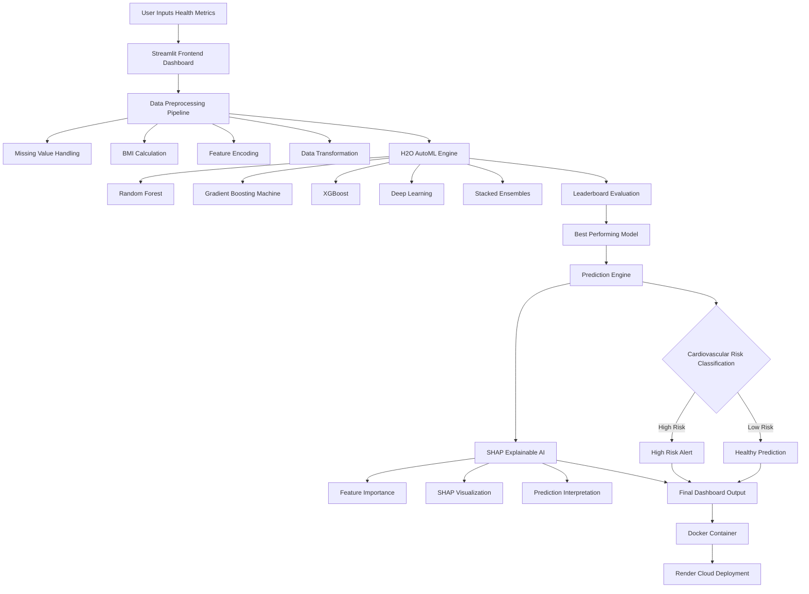
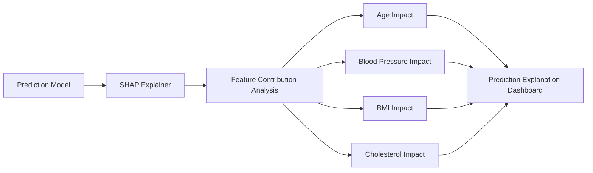

<div align="center">

# ❤️ Cardiovascular Risk Prediction System

###  AI-Powered Cardiovascular Disease Prediction using AutoML + Explainable AI

<p align="center">
  
  
  
  
  
  
  
</p>

---

### 🌐 Live Demo


**Try the Application Here** ➡️ https://cardiovascular-risk-prediction-using.onrender.com

---

### 🎥 Project Demo

https://github.com/user-attachments/assets/80b94f0c-d784-4506-a2b4-7428ffa8ddfd

---

### ❤️ Predict • Prevent • Protect

An intelligent healthcare prediction platform that combines  
**Machine Learning + H2O AutoML + Explainable AI + Streamlit + Docker Deployment**

</div>

---

# 📖 Overview

Cardiovascular diseases remain one of the leading causes of death globally.

Early prediction and preventive healthcare can significantly improve patient outcomes and reduce mortality.

This project presents an **AI-powered Cardiovascular Risk Prediction System** capable of:

- 🧠 Predicting cardiovascular disease risk in real-time
- ⚡ Automatically training multiple machine learning models using H2O AutoML
- 🔍 Explaining AI predictions using SHAP Explainable AI
- 🌐 Delivering predictions through an interactive Streamlit dashboard
- ☁️ Deploying seamlessly using Docker on Render Cloud Platform

The system transforms raw health metrics into meaningful medical intelligence.

---

# 🎯 Problem Statement

Traditional healthcare prediction systems face several challenges:

- ❌ Manual diagnosis processes
- ❌ Limited real-time prediction systems
- ❌ Black-box AI models with no explainability
- ❌ Lack of accessible healthcare intelligence platforms
- ❌ Difficulty interpreting ML-based medical decisions

This project solves these challenges using:

✅ AutoML for intelligent model selection  
✅ Explainable AI for transparency  
✅ Real-time prediction system  
✅ Cloud-based deployment  
✅ Interactive healthcare dashboard

---

# 💡 Proposed Solution

The proposed system integrates:

## 🧠 Intelligent AI Prediction Engine

- Uses **H2O AutoML**
- Automatically trains and compares multiple models
- Selects the best-performing algorithm
- Generates accurate real-time predictions

---

## 🔍 Explainable AI Module

Using **SHAP (SHapley Additive Explanations)**:

- Explains why predictions are high-risk or low-risk
- Shows feature contribution importance
- Improves transparency in medical AI systems

---

## 📊 Interactive Health Dashboard

Built using Streamlit:

- Real-time cardiovascular prediction
- BMI calculation
- Health metric visualization
- User-friendly interface

---

# 🏗️ Detailed System Architecture


---

# 🧠 Explainable AI Architecture



---

# 🧰 Tech Stack

| Category | Technologies |
|---|---|
| Programming Language | Python 3.10 |
| Frontend | Streamlit |
| Machine Learning | H2O AutoML |
| Explainable AI | SHAP |
| Data Processing | Pandas, NumPy |
| Visualization | Matplotlib, Seaborn |
| Deployment | Docker, Render |
| Version Control | Git & GitHub |
| ML Algorithms | GBM, Random Forest, XGBoost, Ensembles |

---

# 📂 Dataset Information

The system uses a cardiovascular healthcare dataset containing approximately **70,000 patient records**.

---

## 📊 Dataset Features

| Feature | Description |
|---|---|
| Age | Patient Age |
| Gender | Male / Female |
| Height | Height in cm |
| Weight | Weight in kg |
| ap_hi | Systolic Blood Pressure |
| ap_lo | Diastolic Blood Pressure |
| Cholesterol | Cholesterol Level |
| Glucose | Glucose Level |
| Smoke | Smoking Status |
| Alcohol | Alcohol Consumption |
| Active | Physical Activity |
| BMI | Body Mass Index |
| Cardio | Target Variable |

---

# 🔄 Machine Learning Workflow

## 1️⃣ Data Preprocessing

### Tasks Performed

- Handling missing values
- Removing duplicates
- Outlier filtering
- BMI feature engineering
- Data normalization
- Feature encoding

---

## 2️⃣ H2O AutoML Training

The system automatically trains:

- 🌲 Random Forest
- 📈 Gradient Boosting Machines
- ⚡ XGBoost
- 🔀 Stacked Ensembles
- 🧬 Deep Learning Models

### AutoML Handles

- Hyperparameter tuning
- Cross-validation
- Model ranking
- Leaderboard generation

---

## 3️⃣ Prediction Pipeline

```text
User Input
   ↓
Feature Engineering
   ↓
H2O AutoML Leader Model
   ↓
Risk Prediction
   ↓
SHAP Explainability
   ↓
Dashboard Visualization
```

---

# 📊 Features

## 🧠 AI Prediction System

- Real-time prediction
- AutoML-powered intelligence
- Leader model selection

---

## 📊 Health Analytics Dashboard

- BMI calculator
- Blood pressure monitoring
- Cholesterol evaluation
- Glucose analysis
- Risk score generation

---

## 🔍 Explainable AI

- SHAP feature importance
- Transparent AI decisions
- Risk interpretation

---

## ☁️ Cloud Deployment

- Dockerized architecture
- Render cloud hosting
- Production-ready deployment

---

# 🖥️ Application Workflow

```text
Health Data Input
        ↓
Streamlit Dashboard
        ↓
Data Preprocessing
        ↓
H2O AutoML Model
        ↓
Prediction Engine
        ↓
SHAP Explainability
        ↓
Risk Visualization Dashboard
```

---

# 📈 Model Performance

| Metric | Score |
|---|---|
| Accuracy | ~73%+ |
| AUC Score | ~0.80 |
| Best Models | GBM / Ensemble Models |

---

# 📊 Visualizations Included

- 📈 ROC Curve
- 🔥 Correlation Heatmap
- 📉 Histograms
- 📌 Scatter Plots
- 📦 BMI Distribution Plot
- 🧠 Feature Importance Graphs
- ✅ Confusion Matrix

---

# ⚙️ Installation

## 1️⃣ Clone Repository

```bash
git clone https://github.com/Keerthishreekesavan/AutoML-and-XAI-for-Cardiovascular-Risk-Prediction
```

---

## 2️⃣ Navigate to Project Directory

```bash
cd AutoML-and-XAI-for-Cardiovascular-Risk-Prediction
```

---

## 3️⃣ Create Virtual Environment

```bash
python -m venv venv
```

---

## 4️⃣ Activate Virtual Environment

### Mac/Linux

```bash
source venv/bin/activate
```

### Windows

```bash
venv\Scripts\activate
```

---

## 5️⃣ Install Dependencies

```bash
pip install -r requirements.txt
```

---

## 6️⃣ Run Streamlit Application

```bash
streamlit run app.py
```

---

# 📦 requirements.txt

```txt
streamlit
pandas
numpy
matplotlib
seaborn
h2o==3.46.0.6
shap
scikit-learn
xgboost
lightgbm
```

---

# 🐳 Docker Deployment

## Build Docker Image

```bash
docker build -t cardio-risk-app .
```

---

## Run Docker Container

```bash
docker run -p 8501:8501 cardio-risk-app
```

---

# ☁️ Render Deployment

## Deployment Steps

1. Push project to GitHub
2. Create new Render Web Service
3. Select Docker Environment
4. Connect GitHub repository
5. Deploy application 🚀

---

# 🐳 Dockerfile

```dockerfile
FROM python:3.10-slim

WORKDIR /app

COPY requirements.txt .

RUN apt-get update && apt-get install -y default-jdk

RUN pip install --no-cache-dir -r requirements.txt

COPY . .

EXPOSE 8501

CMD ["streamlit", "run", "app.py", "--server.port=8501", "--server.address=0.0.0.0"]
```

---

# ⚠️ Known Issues & Fixes

## ❌ H2O Java Error

```text
Cannot find Java
```

### ✅ Solution

Install Java runtime or use Docker image with OpenJDK.

---

## ❌ H2O Version Mismatch

```text
Found version X, running version Y
```

### ✅ Solution

Use identical H2O versions for training and deployment.

---

## ❌ Streamlit Styler Error

Avoid:

```python
applymap()
```

Use:

```python
map()
```

---

# 🚀 Future Enhancements

- 📱 Mobile Application
- 🧬 Deep Learning Integration
- ⌚ Wearable Device Support
- 🏥 Hospital EHR Integration
- 📊 Personalized Healthcare Recommendations
- 🌍 Multi-Disease Prediction Platform
- ☁️ CI/CD Pipeline Integration

---

# ⚠️ Disclaimer

This project is intended for:

- Educational purposes
- Research applications
- Health awareness

🚫 This is NOT a substitute for professional medical diagnosis.

Always consult certified healthcare professionals for medical advice.

---

# 👨‍💻 Author

## Keerthishree Kesavan 🌷

---

# 🔗 Links

- 🌐 Live Demo: https://cardiovascular-risk-prediction-using.onrender.com
- 💻 GitHub: https://github.com/Keerthishreekesavan/AutoML-and-XAI-for-Cardiovascular-Risk-Prediction
- ℹ️ LinkedIn: https://www.linkedin.com/in/keerthishreekesavan/

---

# 📄 License

This project is licensed under the **MIT License**.

See the LICENSE file for more information.

---

# ⭐ Support

If you like this project:

- ⭐ Star this repository
- 🍴 Fork the project
- 🐛 Report issues
- 🚀 Contribute improvements

---

<div align="center">

# ❤️ Predict • Prevent • Protect

### AI + AutoML + Explainable Healthcare Intelligence

</div>
